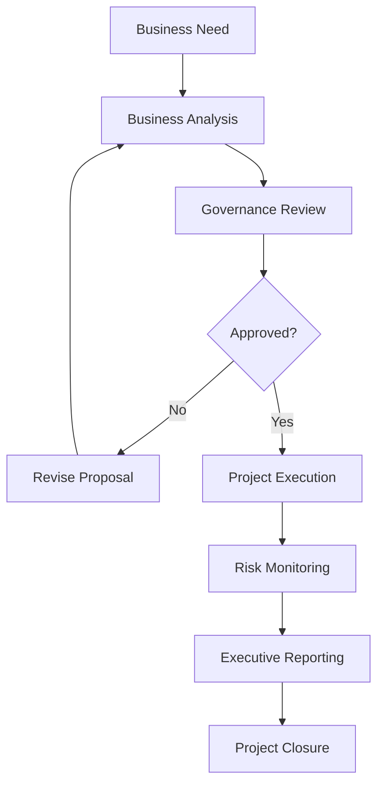

# Governance Framework

## Executive Overview

A governance framework establishes the structure, decision-making processes, roles, responsibilities, and oversight mechanisms required to deliver business and technology initiatives effectively. Strong governance promotes accountability, transparency, regulatory compliance, and alignment with organizational objectives.

> **Portfolio Note:** This document is an original example created for professional portfolio purposes. It demonstrates enterprise governance concepts and does not contain confidential or proprietary information from any employer.

---

# Purpose

The purpose of this Governance Framework is to:

* Define governance responsibilities.
* Establish decision-making authority.
* Support regulatory compliance.
* Improve accountability.
* Enable effective risk management.
* Promote consistent project oversight.

---

# Governance Principles

The framework is built upon the following principles:

* Accountability
* Transparency
* Risk-Based Decision Making
* Regulatory Compliance
* Business and Technology Alignment
* Continuous Improvement

---

# Governance Structure

| Governance Level             | Responsibilities                                            |
| ---------------------------- | ----------------------------------------------------------- |
| Executive Steering Committee | Strategic direction, funding approval, executive decisions  |
| Business Leadership          | Business priorities, scope approval, stakeholder engagement |
| Project Management           | Project planning, execution, reporting                      |
| Business Analysis            | Requirements management, stakeholder coordination           |
| Technology Leadership        | Solution delivery, technical oversight                      |
| Risk & Compliance            | Governance reviews, regulatory oversight                    |
| Audit                        | Independent assurance and control evaluation                |

---

# Decision-Making Process

---

# Governance Activities

* Executive Steering Committee meetings
* Risk reviews
* Status reporting
* Change control
* Requirements approval
* Project health assessments
* Compliance reviews
* Audit support

---

# Key Deliverables

* Business Case
* Project Charter
* Requirements Documentation
* Risk Register
* Status Reports
* Executive Dashboards
* Audit Evidence
* Lessons Learned

---

# Success Measures

* Governance milestones completed on schedule.
* Risks reviewed regularly.
* Stakeholder approvals documented.
* Compliance requirements satisfied.
* Executive reporting delivered on time.
* Projects align with business objectives.

---

# Skills Demonstrated

* Governance
* Risk Management
* Business Analysis
* Executive Reporting
* Compliance
* Stakeholder Management
* Decision Support
* Project Oversight

